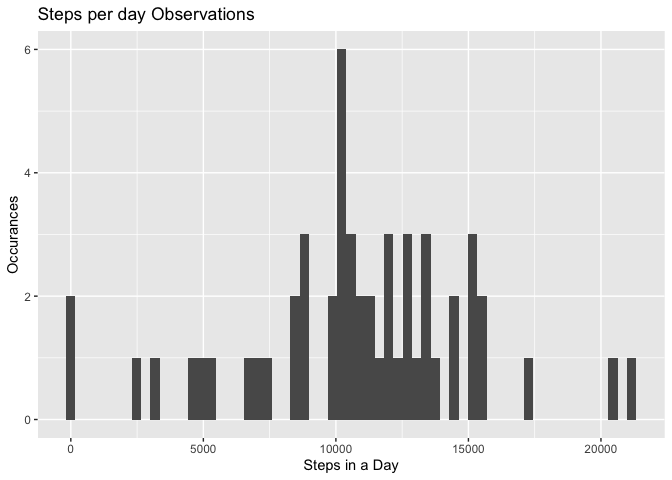
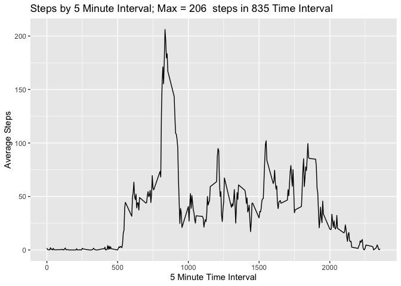
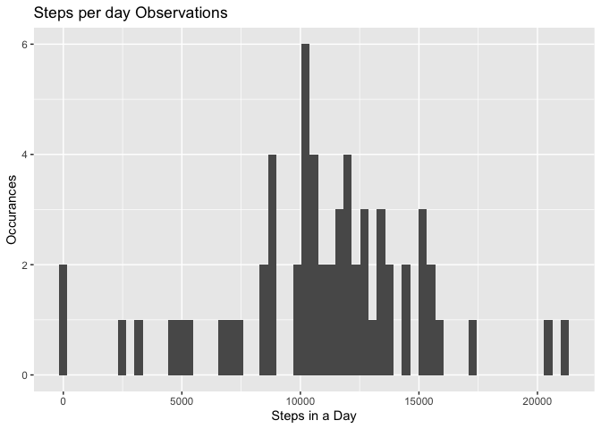
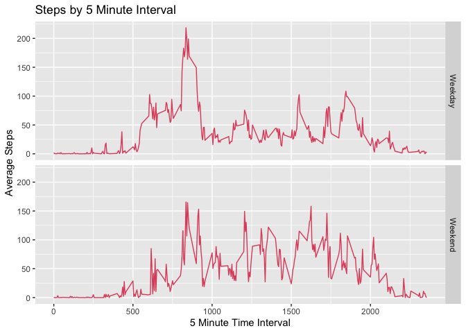

## Loading and preprocessing the data
This script loads data into the variable "ad" for use in the rest of the 
scripts. It also loads the packages required to process the data.

```r
     ad <- read.csv("activity.csv")
     ad$date <- as.Date(as.character(ad$date), "%Y-%m-%d")
     ad$steps <- as.double(ad$steps)
     ad <<- ad
```


## What is mean total number of steps taken per day?
The following script summarizes the data for the plot and then plots it.

```r
     require(dplyr)
     require(ggplot2)
        ad2 <- filter(ad, !is.na(ad$steps))
        ad2 <- ad %>% group_by(date) %>%
                summarise(tSteps = sum(steps))
        ad2 <<- subset(ad2, !is.na(ad2$tSteps))
        qplot(x = ad2$tSteps, geom = "histogram", bins = 61, 
              main = "Steps per day Observations", 
              xlab = "Steps in a Day", 
              ylab = "Occurances")
```

<!-- -->
The mean and median are calculated as follows:

```r
        mn <- round(mean(ad2$tSteps, na.rm = TRUE),0)
        md <- round(median(ad2$tSteps, na.rm = TRUE),0)
        ms <- paste("The mean is", format(mn, big.mark = ","),
                    "and the median is", format(md, big.mark = ","))
     print(ms)
```

```
## [1] "The mean is 10,766 and the median is 10,765"
```
The mean is aligned to the graph indicating just over 10,000 is the median
of the number of steps per day.

## What is the average daily activity pattern?
The first code is to setup the factor variable with by weekday, then summarize
by the 5 minute time interval.

```r
        require(dplyr)
        require(ggplot2)
        ad5 <- ad
        ad5 <- ad %>% group_by(interval) %>%
                summarise(av = mean(steps, na.rm = TRUE))
        ad5 <<- filter(ad5, !is.na(ad5$av))
        a <- max(ad5$av)
        b <- subset(ad5, ad5$av == a)
```

The next step is to plot the results.

```r
          g <- ggplot(ad5, aes(interval, av)) + geom_line() + 
                labs(title = paste("Steps by 5 Minute Interval; Max =",
                                   round(b$av,0)," steps in",b$interval,
                                   "Time Interval"), 
                     x = "5 Minute Time Interval", 
                     y = "Average Steps")
        print(g)
```

<!-- -->
The maximum average steps are 206 steps in the 835 time interval.

## Imputing missing values

Calculate the total number of NA's

```r
        n <- sum(is.na(ad$steps))
        print(paste("the total number of NA's in steps is",n,"."))
```

```
## [1] "the total number of NA's in steps is 2304 ."
```
I have chosen to use the predictive mean matches method to impute the NA's in 
the dataset and put it in the data frame ad6

```r
        require(mice)
        imp <- mice(ad)
        ad6 <<- complete(imp)
        ad6 <<- ad6 %>% group_by(date) %>%
                summarise(tSteps = sum(steps))
```
Here is the histogram of the total number of steps taken each day.

```r
        require(ggplot2)
        print(qplot(x = ad6$tSteps, geom = "histogram", bins = 61, 
            main = "Steps per day Observations", 
            xlab = "Steps in a Day", 
            ylab = "Occurances"))
```

<!-- -->
The metrics of the imputed data are as follows.

```r
        mn2 <- round(mean(ad6$tSteps, na.rm = TRUE),0)
        md2 <- round(median(ad6$tSteps, na.rm = TRUE),0)
        ms3 <- "The current results are:"
        ms2 <- paste("The mean is", format(mn2, big.mark = ",")
                     , "and the median is", format(md2, big.mark = ","))
        ms4 <- "The previous result with NAs was:"
        ms5 <- "the difference between the results are:"
        ms6 <- paste("The difference in Mean is", mn2 - mn)
        ms7 <- paste("The difference in Median is", md2 - md)
        print(c(ms3, ms2, ms4, ms, ms6, ms7))
```

```
## [1] "The current results are:"                   
## [2] "The mean is 10,939 and the median is 11,162"
## [3] "The previous result with NAs was:"          
## [4] "The mean is 10,766 and the median is 10,765"
## [5] "The difference in Mean is 173"              
## [6] "The difference in Median is 397"
```
the result is more values were imputed and raised the average and
the mean of the results.

## Are there differences in activity patterns between weekdays and weekends?
The code to make the factored data frame for weekday and wekends is:

```r
        require(dplyr)
        require(ggplot2)
        require(mice)
        imp <- mice(ad)
        ad3 <- complete(imp)
        ad3$wday <- weekdays(ad3$date)
        ad3$wk <- "Weekday"
        a <- 1
        for(i in ad3$wday){
                if(ad3$wday[a] == "Saturday"){ad3$wk[a] <- "Weekend"}
                if(ad3$wday[a] == "Sunday"){ad3$wk[a] <- "Weekend"}
                a <-a+1}
        ad3$wk <- as.factor(ad3$wk)
        ad3 <- ad3 %>% group_by(wk, interval) %>%
                summarize(av = mean(steps, na.rm = TRUE))
        ad3 <<- ad3
```
Now plot the results comparing the weekday vs. weekend.

```r
        g <- ggplot(ad3, aes(interval, av)) + geom_line(color = 2) + 
                facet_grid(wk~.) +
                labs(title = "Steps by 5 Minute Interval", 
                     x = "5 Minute Time Interval", 
                     y = "Average Steps")
        print(g)
```

<!-- -->
